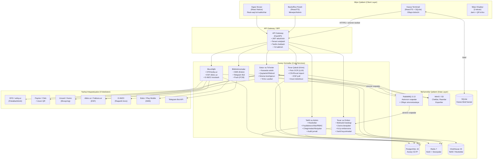
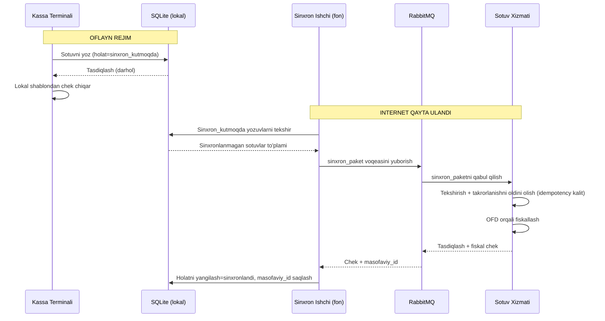
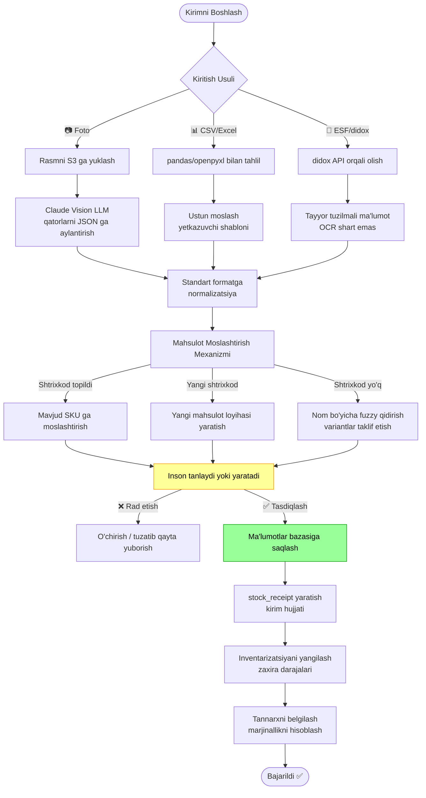
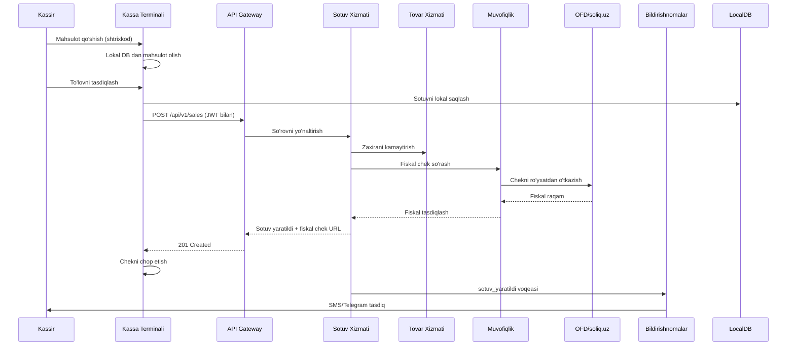

# PossKassa — Tizim Arxitekturasi

## 1. Yuqori Darajadagi Komponent Diagrammasi



---

## 2. Oflayn-Birinchi Sinxronizatsiya Arxitekturasi



---

## 3. Tovar Qabuli (Kirim) Quvuri



---

## 4. Ko'p Ijarachilik (Multi-Tenant) Arxitekturasi

Har bir so'rov quyidagilarni o'z ichiga oladi:
1. **JWT** (Keycloak dan) — `tenant_id`, `user_id`, `rollar` mavjud
2. **API Gateway** tenant ni JWT dan aniqlaydi, `X-Tenant-ID` sarlavhasini qo'shadi
3. **Barcha DB so'rovlari** SQLAlchemy event hook orqali `WHERE tenant_id = :tid` sharti bilan amalga oshiriladi
4. **PostgreSQL RLS (Qator Darajasida Xavfsizlik)** — ikkinchi qatlam himoyasi

```sql
-- Misol RLS siyosati
CREATE POLICY tenant_isolation ON sales
  USING (tenant_id = current_setting('app.tenant_id')::uuid);
```

---

## 5. RBAC Rollari va Ruxsatlar

| Amal | Kassir | Menejer | Admin | Egasi |
|------|--------|---------|-------|-------|
| Sotuv yaratish | ✅ | ✅ | ✅ | ✅ |
| Qaytarish/Refund | ❌ | ✅ | ✅ | ✅ |
| Smenani ochish/yopish | ✅ | ✅ | ✅ | ✅ |
| Hisobotlarni ko'rish | ❌ | ✅ | ✅ | ✅ |
| Mahsulotlarni boshqarish | ❌ | ✅ | ✅ | ✅ |
| Tovar qabuli (kirim) | ❌ | ✅ | ✅ | ✅ |
| Foydalanuvchilarni boshqarish | ❌ | ❌ | ✅ | ✅ |
| Tenant boshqarish | ❌ | ❌ | ❌ | ✅ |
| Audit jurnalini ko'rish | ❌ | ❌ | ✅ | ✅ |
| Integratsiyalarni sozlash | ❌ | ❌ | ✅ | ✅ |

---

## 6. Ma'lumotlar Oqimi — Sotuv Amali


