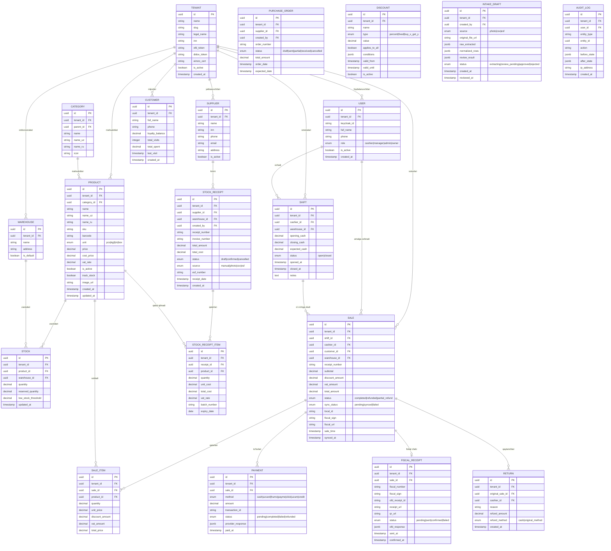

# PossKassa — Ma'lumotlar Bazasi Sxemasi (ERD)

## Jadvallar Ro'yxati

### 1. TENANT (Ijarachilar)
### 2. USER (Foydalanuvchilar)
### 3. PRODUCT (Mahsulotlar)
### 4. CATEGORY (Kategoriyalar)
### 5. WAREHOUSE (Omborxonalar)
### 6. STOCK (Zaxira)
### 7. SHIFT (Smenalar)
### 8. SALE (Sotuvlar)
### 9. SALE_ITEM (Sotuv qatorlari)
### 10. PAYMENT (To'lovlar)
### 11. RETURN (Qaytarishlar)
### 12. STOCK_RECEIPT (Tovar qabuli / Kirim)
### 13. STOCK_RECEIPT_ITEM (Kirim qatorlari)
### 14. SUPPLIER (Yetkazuvchilar)
### 15. PURCHASE_ORDER (Xarid buyurtmalari)
### 16. CUSTOMER (Mijozlar)
### 17. DISCOUNT (Chegirmalar)
### 18. FISCAL_RECEIPT (Fiskal cheklar)
### 19. AUDIT_LOG (Audit jurnali)
### 20. INTAKE_DRAFT (Kirim loyihalari — tekshiruv uchun)

---

## ERD Diagrammasi



---

## SQL Sxemasi (PostgreSQL)

```sql
-- ============================================================
-- TENANT (Ijarachilar)
-- ============================================================
CREATE TABLE tenants (
    id UUID PRIMARY KEY DEFAULT gen_random_uuid(),
    name VARCHAR(255) NOT NULL,
    slug VARCHAR(100) UNIQUE NOT NULL,
    legal_name VARCHAR(255),
    inn VARCHAR(20),
    ofd_token TEXT,
    didox_token TEXT,
    eimzo_cert TEXT,
    is_active BOOLEAN DEFAULT TRUE,
    created_at TIMESTAMPTZ DEFAULT NOW()
);

-- ============================================================
-- USER (Foydalanuvchilar)
-- ============================================================
CREATE TABLE users (
    id UUID PRIMARY KEY DEFAULT gen_random_uuid(),
    tenant_id UUID NOT NULL REFERENCES tenants(id),
    keycloak_id VARCHAR(255) UNIQUE NOT NULL,
    full_name VARCHAR(255) NOT NULL,
    phone VARCHAR(20),
    role VARCHAR(20) NOT NULL CHECK (role IN ('cashier','manager','admin','owner')),
    is_active BOOLEAN DEFAULT TRUE,
    created_at TIMESTAMPTZ DEFAULT NOW()
);

-- ============================================================
-- CATEGORY (Kategoriyalar)
-- ============================================================
CREATE TABLE categories (
    id UUID PRIMARY KEY DEFAULT gen_random_uuid(),
    tenant_id UUID NOT NULL REFERENCES tenants(id),
    parent_id UUID REFERENCES categories(id),
    name VARCHAR(255) NOT NULL,
    name_uz VARCHAR(255),
    name_ru VARCHAR(255),
    icon VARCHAR(100)
);

-- ============================================================
-- PRODUCT (Mahsulotlar)
-- ============================================================
CREATE TABLE products (
    id UUID PRIMARY KEY DEFAULT gen_random_uuid(),
    tenant_id UUID NOT NULL REFERENCES tenants(id),
    category_id UUID REFERENCES categories(id),
    name VARCHAR(255) NOT NULL,
    name_uz VARCHAR(255),
    name_ru VARCHAR(255),
    sku VARCHAR(100),
    barcode VARCHAR(100),
    unit VARCHAR(20) DEFAULT 'pcs' CHECK (unit IN ('pcs','kg','l','m','box')),
    price NUMERIC(15,2) NOT NULL DEFAULT 0,
    cost_price NUMERIC(15,2) DEFAULT 0,
    vat_rate NUMERIC(5,2) DEFAULT 12.0,
    is_active BOOLEAN DEFAULT TRUE,
    track_stock BOOLEAN DEFAULT TRUE,
    image_url TEXT,
    created_at TIMESTAMPTZ DEFAULT NOW(),
    updated_at TIMESTAMPTZ DEFAULT NOW()
);
CREATE UNIQUE INDEX idx_products_barcode_tenant ON products(tenant_id, barcode) WHERE barcode IS NOT NULL;

-- ============================================================
-- WAREHOUSE (Omborxonalar)
-- ============================================================
CREATE TABLE warehouses (
    id UUID PRIMARY KEY DEFAULT gen_random_uuid(),
    tenant_id UUID NOT NULL REFERENCES tenants(id),
    name VARCHAR(255) NOT NULL,
    address TEXT,
    is_default BOOLEAN DEFAULT FALSE
);

-- ============================================================
-- STOCK (Zaxira)
-- ============================================================
CREATE TABLE stock (
    id UUID PRIMARY KEY DEFAULT gen_random_uuid(),
    tenant_id UUID NOT NULL REFERENCES tenants(id),
    product_id UUID NOT NULL REFERENCES products(id),
    warehouse_id UUID NOT NULL REFERENCES warehouses(id),
    quantity NUMERIC(15,3) DEFAULT 0,
    reserved_quantity NUMERIC(15,3) DEFAULT 0,
    low_stock_threshold NUMERIC(15,3) DEFAULT 5,
    updated_at TIMESTAMPTZ DEFAULT NOW(),
    UNIQUE(product_id, warehouse_id)
);

-- ============================================================
-- SHIFT (Smenalar)
-- ============================================================
CREATE TABLE shifts (
    id UUID PRIMARY KEY DEFAULT gen_random_uuid(),
    tenant_id UUID NOT NULL REFERENCES tenants(id),
    cashier_id UUID NOT NULL REFERENCES users(id),
    warehouse_id UUID NOT NULL REFERENCES warehouses(id),
    opening_cash NUMERIC(15,2) DEFAULT 0,
    closing_cash NUMERIC(15,2),
    expected_cash NUMERIC(15,2),
    status VARCHAR(10) DEFAULT 'open' CHECK (status IN ('open','closed')),
    opened_at TIMESTAMPTZ DEFAULT NOW(),
    closed_at TIMESTAMPTZ,
    notes TEXT
);

-- ============================================================
-- SALE (Sotuvlar)
-- ============================================================
CREATE TABLE sales (
    id UUID PRIMARY KEY DEFAULT gen_random_uuid(),
    tenant_id UUID NOT NULL REFERENCES tenants(id),
    shift_id UUID REFERENCES shifts(id),
    cashier_id UUID NOT NULL REFERENCES users(id),
    customer_id UUID REFERENCES customers(id),
    warehouse_id UUID NOT NULL REFERENCES warehouses(id),
    receipt_number VARCHAR(50) NOT NULL,
    subtotal NUMERIC(15,2) NOT NULL DEFAULT 0,
    discount_amount NUMERIC(15,2) DEFAULT 0,
    vat_amount NUMERIC(15,2) DEFAULT 0,
    total_amount NUMERIC(15,2) NOT NULL,
    status VARCHAR(20) DEFAULT 'completed',
    sync_status VARCHAR(10) DEFAULT 'pending',
    local_id VARCHAR(100),          -- Kassa dan kelgan ID
    fiscal_sign VARCHAR(255),
    fiscal_url TEXT,
    sale_time TIMESTAMPTZ DEFAULT NOW(),
    synced_at TIMESTAMPTZ
);

-- ============================================================
-- SALE_ITEM (Sotuv qatorlari)
-- ============================================================
CREATE TABLE sale_items (
    id UUID PRIMARY KEY DEFAULT gen_random_uuid(),
    tenant_id UUID NOT NULL REFERENCES tenants(id),
    sale_id UUID NOT NULL REFERENCES sales(id) ON DELETE CASCADE,
    product_id UUID NOT NULL REFERENCES products(id),
    quantity NUMERIC(15,3) NOT NULL,
    unit_price NUMERIC(15,2) NOT NULL,
    discount_amount NUMERIC(15,2) DEFAULT 0,
    vat_amount NUMERIC(15,2) DEFAULT 0,
    total_price NUMERIC(15,2) NOT NULL
);

-- ============================================================
-- PAYMENT (To'lovlar)
-- ============================================================
CREATE TABLE payments (
    id UUID PRIMARY KEY DEFAULT gen_random_uuid(),
    tenant_id UUID NOT NULL REFERENCES tenants(id),
    sale_id UUID NOT NULL REFERENCES sales(id),
    method VARCHAR(20) NOT NULL CHECK (method IN ('cash','uzcard','humo','payme','click','uzum','credit')),
    amount NUMERIC(15,2) NOT NULL,
    transaction_id VARCHAR(255),
    status VARCHAR(20) DEFAULT 'completed',
    provider_response JSONB,
    paid_at TIMESTAMPTZ DEFAULT NOW()
);

-- ============================================================
-- CUSTOMER (Mijozlar)
-- ============================================================
CREATE TABLE customers (
    id UUID PRIMARY KEY DEFAULT gen_random_uuid(),
    tenant_id UUID NOT NULL REFERENCES tenants(id),
    full_name VARCHAR(255),
    phone VARCHAR(20) UNIQUE,
    loyalty_balance NUMERIC(15,2) DEFAULT 0,
    total_visits INTEGER DEFAULT 0,
    total_spent NUMERIC(15,2) DEFAULT 0,
    last_visit TIMESTAMPTZ,
    created_at TIMESTAMPTZ DEFAULT NOW()
);

-- ============================================================
-- SUPPLIER (Yetkazuvchilar)
-- ============================================================
CREATE TABLE suppliers (
    id UUID PRIMARY KEY DEFAULT gen_random_uuid(),
    tenant_id UUID NOT NULL REFERENCES tenants(id),
    name VARCHAR(255) NOT NULL,
    inn VARCHAR(20),
    phone VARCHAR(20),
    email VARCHAR(255),
    address TEXT,
    column_mapping JSONB,   -- CSV shabloni
    is_active BOOLEAN DEFAULT TRUE
);

-- ============================================================
-- STOCK_RECEIPT (Tovar Qabuli / Kirim)
-- ============================================================
CREATE TABLE stock_receipts (
    id UUID PRIMARY KEY DEFAULT gen_random_uuid(),
    tenant_id UUID NOT NULL REFERENCES tenants(id),
    supplier_id UUID REFERENCES suppliers(id),
    warehouse_id UUID NOT NULL REFERENCES warehouses(id),
    created_by UUID NOT NULL REFERENCES users(id),
    receipt_number VARCHAR(50) NOT NULL,
    invoice_number VARCHAR(100),
    total_amount NUMERIC(15,2) DEFAULT 0,
    total_cost NUMERIC(15,2) DEFAULT 0,
    status VARCHAR(20) DEFAULT 'draft' CHECK (status IN ('draft','confirmed','cancelled')),
    source VARCHAR(20) DEFAULT 'manual' CHECK (source IN ('manual','photo','csv','esf')),
    esf_number VARCHAR(100),
    receipt_date TIMESTAMPTZ DEFAULT NOW(),
    created_at TIMESTAMPTZ DEFAULT NOW()
);

-- ============================================================
-- STOCK_RECEIPT_ITEM (Kirim qatorlari)
-- ============================================================
CREATE TABLE stock_receipt_items (
    id UUID PRIMARY KEY DEFAULT gen_random_uuid(),
    tenant_id UUID NOT NULL REFERENCES tenants(id),
    receipt_id UUID NOT NULL REFERENCES stock_receipts(id) ON DELETE CASCADE,
    product_id UUID REFERENCES products(id),
    quantity NUMERIC(15,3) NOT NULL,
    unit_cost NUMERIC(15,2) NOT NULL,
    total_cost NUMERIC(15,2) NOT NULL,
    vat_rate NUMERIC(5,2) DEFAULT 12.0,
    batch_number VARCHAR(100),
    expiry_date DATE
);

-- ============================================================
-- INTAKE_DRAFT (Kirim Loyihasi — OCR/Import tekshiruvi)
-- ============================================================
CREATE TABLE intake_drafts (
    id UUID PRIMARY KEY DEFAULT gen_random_uuid(),
    tenant_id UUID NOT NULL REFERENCES tenants(id),
    created_by UUID NOT NULL REFERENCES users(id),
    source VARCHAR(20) NOT NULL CHECK (source IN ('photo','csv','esf')),
    original_file_url TEXT,
    raw_extracted JSONB,
    normalized_rows JSONB,
    review_result JSONB,
    status VARCHAR(30) DEFAULT 'extracting'
        CHECK (status IN ('extracting','review_pending','approved','rejected')),
    created_at TIMESTAMPTZ DEFAULT NOW(),
    reviewed_at TIMESTAMPTZ
);

-- ============================================================
-- FISCAL_RECEIPT (Fiskal Cheklar)
-- ============================================================
CREATE TABLE fiscal_receipts (
    id UUID PRIMARY KEY DEFAULT gen_random_uuid(),
    tenant_id UUID NOT NULL REFERENCES tenants(id),
    sale_id UUID NOT NULL REFERENCES sales(id),
    fiscal_number VARCHAR(100),
    fiscal_sign VARCHAR(255),
    ofd_receipt_id VARCHAR(100),
    receipt_url TEXT,
    qr_url TEXT,
    status VARCHAR(20) DEFAULT 'pending',
    ofd_response JSONB,
    sent_at TIMESTAMPTZ,
    confirmed_at TIMESTAMPTZ
);

-- ============================================================
-- AUDIT_LOG (Audit Jurnali)
-- ============================================================
CREATE TABLE audit_logs (
    id UUID PRIMARY KEY DEFAULT gen_random_uuid(),
    tenant_id UUID NOT NULL REFERENCES tenants(id),
    user_id UUID REFERENCES users(id),
    entity_type VARCHAR(100) NOT NULL,
    entity_id UUID,
    action VARCHAR(50) NOT NULL,
    before_state JSONB,
    after_state JSONB,
    ip_address VARCHAR(45),
    created_at TIMESTAMPTZ DEFAULT NOW()
);

-- ============================================================
-- RLS SIYOSATLARI
-- ============================================================
ALTER TABLE sales ENABLE ROW LEVEL SECURITY;
CREATE POLICY tenant_isolation_sales ON sales
    USING (tenant_id = current_setting('app.tenant_id')::uuid);

-- (Barcha jadvallar uchun xuddi shunday)

-- ============================================================
-- INDEKSLAR
-- ============================================================
CREATE INDEX idx_sales_tenant_shift ON sales(tenant_id, shift_id);
CREATE INDEX idx_sales_tenant_time ON sales(tenant_id, sale_time DESC);
CREATE INDEX idx_sale_items_sale ON sale_items(sale_id);
CREATE INDEX idx_stock_product ON stock(product_id, warehouse_id);
CREATE INDEX idx_products_barcode ON products(barcode) WHERE barcode IS NOT NULL;
CREATE INDEX idx_audit_entity ON audit_logs(tenant_id, entity_type, entity_id);
CREATE INDEX idx_audit_time ON audit_logs(tenant_id, created_at DESC);
```
